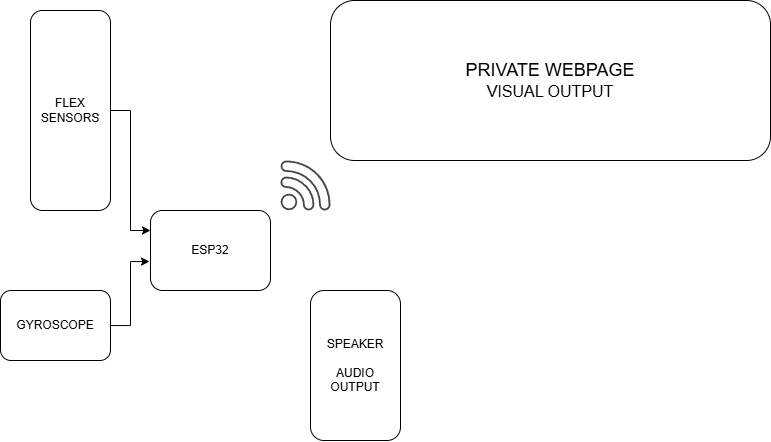

**Team Members:**
* Kris Gurung
* Anirudhhan Raghuraman
* Madalyn Wiley

**Project Goals:**
* Design an American Sign Language (ASL) interpreting glove that converts sign language to English and outputs the translation.
* Recognize and translate the entire ASL alphabet.
* Identify and process basic static signs.
* Design a PCB for the circuit.

**Necessary Equipment and Sensors:**
* [ESP32 microcontroller x 2](https://www.amazon.com/HiLetgo-ESP-WROOM-32-Development-Microcontroller-Integrated/dp/B0718T232Z/ref=sr_1_1?crid=1E77MJF3QUDXL&dib=eyJ2IjoiMSJ9.soccUwva0RJIrxBgE16WUjGVb2gBzEZbRkcOjXFbl7txw_m8j2eB6sRBQfng_1By2xLbPOThXIIX6mm44zSRKBxo3DmCSaaPxRREeTvaz6mRqJSFdvX0UV4u7YCUFF9VzJMH5HSEm69ay5sR7vqI16iSSKkc1n5M4U171zWHULnC6If07JvZlS_vyRk9eYY7LQVSKsYTOywvE9E0JswhrlGnK3uilLnHBdO0v0LSaLqrTVmNWqHisUFKCX0RmKDC_S3Y7NVDhJZNNPbb7mO3_IXQbJ1bYXfzatGhKCRAPVQ.BtD1TH4fLNusaAd__wgz_MqSrZH6kXXjVtp4MKl7kw4&dib_tag=se&keywords=ESP32+adafruit&qid=1745643407&s=industrial&sprefix=esp32+adafruit%2Cindustrial%2C97&sr=1-1)
* [Flex sensors x 15](https://www.amazon.com/dp/B00LP25V1A?ref=ppx_yo2ov_dt_b_fed_asin_title&th=1)
* [MPU6050 x 2](https://www.amazon.com/dp/B0BLGT1F5F?ref=ppx_yo2ov_dt_b_fed_asin_title)
* [Pair of gloves x 1](https://www.amazon.com/Cotton-Gloves-Handling-Inspection-Photography/dp/B07ZMXNCQ5/ref=sr_1_1_sspa?crid=38A9OGK836FWP&dib=eyJ2IjoiMSJ9.RmDXSiT6_NwJIY7lLORg_hXRWdsfz5oneae0ttufA6xlE6yOU3XQI5IIw6CIP2ooXhPPXH6yb202yVkcDbKFN4tPhf6yFDZhMkIwZQfw2T55du-INUa5a1qSomWbeLcX6CZY6OHX3BhG44cjwEK9NmnZh7daNdz0VL7yuGMPpklnTagvLmJEJSSrEW2Hh6p0hE0ZwRGx5XYDeJZQDgXf2UWIse_s8L0uHNks6Kb9-btsYlCjnz9PRu4FuRj5JpmsLnc2chX2WcwSZNavxAectru4EzFSM2AwrvvHo5iIlK4.F7i_RE5KeiKyVe0g_Vekxm2Gx2jjtA3lpxnY2aW0wPw&dib_tag=se&keywords=gloves%2Bcotton&qid=1745643483&sprefix=gloves%2Bcotton%2Caps%2C123&sr=8-1-spons&sp_csd=d2lkZ2V0TmFtZT1zcF9hdGY&th=1)

  Note - The links for the products are embedded in the text. Clicking the link will redirect you to amazon.com.

# Project Description
The ASL-interpreting glove will be designed to detect hand gestures and translate them into spoken words and a visual interface output. The system will consist of flex sensors to track finger movements, MPU6050 sensors for motion detection, and ESP32 microcontrollers to process and transmit data to an output system.



# System Setup
### Hardware
- The hardware consists of five flex sensors and an IMU in each hand
- The flex sensors need to be connected to the analog pins of the ESP32. Make sure to choose the correct pins according to your circuit.
	- All the ESP32 models do not have analog pins. If that happens, check the datasheet of the ESP32 and use the ADC pins instead and you should be good to go.
	- Many ESP32 boards have the issue of some pins being rendered useless when the wifi module is on. If the pin that is needed is being used by wifi, then, you have no choice other than using a different pin.
	
- The flex sensors need to create a conventional voltage divider circuit with the same value of resistors across all sensors (We have used the 10KOhm Resistor).
- The IMU follows a straight forward serial connection. 
	- Connect the power rails together
	- Connect the Serial Clock and the Serial Data of the IMU to the Serial Clock and Serial Data of the ESP32 respectively
- This concludes the hardware setup of the glove.

### Software 
The software consists of 4 parts.
- Arduino IDE Setup
- Firebase Setup
- Arduino Execution 
- HTML Setup and Execution

#### Arduino IDE Setup
- Download the Arduino IDE.
- Open the IDE.
- To make the ESP32 compatable, go to File > Preferences
- Paste this link in the Additional Board Manager URL's box
	- "https://raw.githubusercontent.com/espressif/arduino-esp32/gh-pages/package_esp32_index.json"
- Restart the IDE
- Go to Boards Manager and download the ESP32 package.
- Install the following libraries.
	- WiFi.h
	- Firebase_ESP_Client.h
	- Adafruit mpu6050
	- Adafruit Unified Sensor
	- Adafruit BusIO

- We will be using 2 scripts in this approach, but technically, there are many scripts in the repository that follow different methods that result in the same results.
- The process that we followed for this project is to essentially fetch data from the sensors, package the data into a JSON file, send it to a Firebase server and have the HTML file scrap data from there.

#### Firebase Setup
- Open Firebase in your browser.
- Login using your Google account.
- Go to Console.
- Create a new Firebase Project.
- Name your Project whatever you want. We have called it "ASL-Interpreter-Glove"
- Follow the instruction on screen and create the project.
- Enter the project.
- In the right side, Navigate to Product Categories > Build > Realtime Database.
- This is where our data will be seen.
- The link that is seen on top is our "DATABASE_URL". We will need this.
- Go to the project settings on the top right corner of the page.
- We will need the "API_KEY".
- This concludes the firebase setup. Missing out on any of these steps will result in the code not working.

#### Arduino Execution
- Open up the Arduino Editor.
- Since we have 2 gloves, we will have to upload and run 2 different codes on 2 ESP32s. But first, some modifications must be made to the code so that it will be compatible with the computer and the server.
- The changes are the same for both the codes.
- Set up the wifi network in the code
	- I have put placeholder values for the SSID and passwords for safety. This needs to be changed prior to running.
	- Replace WIFI_SSID and WIFI_PASSWORD with your credentials. Make sure that the network is in the 2.4GHz band 
	- Replace API_KEY and DATABASE_URL with the information we got from the firebase server.
- Once all of this is done, the code is ready to be dumped in the ESP32
- For the left hand and up and load [Firebase_Flex_Left.ino](Firebase%20Stuff/Firebase_Flex_Right/Firebase_Flex_Right.ino)
- Do the same with [Firebase_Flex_Right.ino](Firebase%20Stuff/Firebase_Flex_Right/Firebase_Flex_Right.ino) for the ESP32 that goes on the Right hand.

#### HTML Setup and Execution
- Once the server is up and running, We will have to setup the webpage where the inferences will be shown.
- Download the [webserver.html](webserver.html) file.
- Make the changes in lines 192, 193, 194 with the API_KEY, DATABASE_URL and PROJECT_ID.
- Now, host the file with python
	- Go to the file directory and open a python interactive terminal.
	- Run this code  ``` python3 -m SimpleHTTPServer 3000```
	- This will locally host the webpage.
	- Open the web browser and type ```localhost:3000 ```
	- The port used here is 3000, this can be changed to any other port too.


# Machine Learning Model Interpretation
- The machine learning model runs by taking data out of the serial ports.
- When the ESP32 is executing the code, close all the serial monitors and then run the python sctript [INT_model_inference.py](Interpretation/INT_model_inference.py).
- This will run the machine learning model and send inferences to the webpage.

# Possible Future Works
* Support for dynamic signs.
* Integration of two gloves for improved accuracy.
